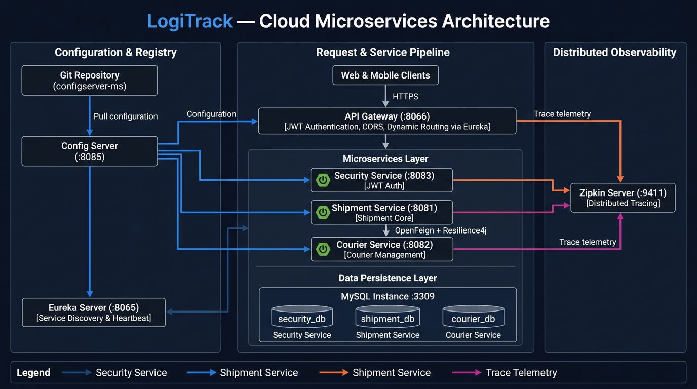
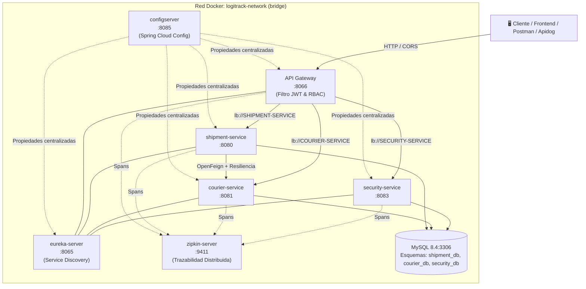

# 📦 LogiTrack Infraestructura & Orquestación (Sprint 3)

[](https://www.docker.com/)
[](https://docs.docker.com/compose/)
[](https://adoptium.net/)
[](https://spring.io/projects/spring-boot)
[](https://spring.io/projects/spring-cloud)
[](https://www.mysql.com/)

Repositorio oficial de infraestructura y orquestación del proyecto **LogiTrack (LazyHawk)** para la cátedra de **DAAS (2026)** - Universidad Nacional de Jujuy (UNJu).

Este repositorio centraliza la orquestación con `docker-compose.yml` para desplegar el ecosistema distribuido completo del Sprint 3: **API Gateway**, **Eureka Server**, **Zipkin**, **Config Server**, **Bases de Datos MySQL independientes** y **Microservicios de Dominio** comunicados con OpenFeign y resiliencia.

---

## 🏛️ Arquitectura del Ecosistema (Sprint 3)

<p align="center">
  
</p>

Toda petición externa ingresa obligatoriamente por el **API Gateway** (puerto `8066`), el cual valida los tokens JWT, aplica control de acceso basado en roles (RBAC), gestiona políticas de CORS y enruta dinámicamente (`lb://`) mediante **Eureka Server**.


```mermaid
flowchart TD
    Client["🖥️ Cliente / Frontend / Postman / Apidog"] -->|HTTP / CORS| GW["API Gateway\n:8066\n(Filtro JWT & RBAC)"]

    subgraph DockerNetwork ["Red Docker: logitrack-network (bridge)"]
        GW -->|lb://SECURITY-SERVICE| SEC["security-service\n:8083"]
        GW -->|lb://COURIER-SERVICE| COUR["courier-service\n:8081"]
        GW -->|lb://SHIPMENT-SERVICE| SHIP["shipment-service\n:8080"]

        SHIP -->|OpenFeign + Resiliencia| COUR

        EUR["eureka-server\n:8065\n(Service Discovery)"]
        CFG["configserver\n:8085\n(Spring Cloud Config)"]
        ZIP["zipkin-server\n:9411\n(Trazabilidad Distribuida)"]

        DB[("MySQL 8.4:3306\nEsquemas: shipment_db, courier_db, security_db")]

        SEC --- EUR
        COUR --- EUR
        SHIP --- EUR
        GW --- EUR

        CFG -.->|Propiedades centralizadas| SEC
        CFG -.->|Propiedades centralizadas| COUR
        CFG -.->|Propiedades centralizadas| SHIP
        CFG -.->|Propiedades centralizadas| GW
        CFG -.->|Propiedades centralizadas| EUR

        SEC --> DB
        COUR --> DB
        SHIP --> DB

        SEC -.->|Spans| ZIP
        COUR -.->|Spans| ZIP
        SHIP -.->|Spans| ZIP
        GW -.->|Spans| ZIP
    end
```

---

## 🗄️ Estado de las Bases de Datos

* **Las imágenes de MySQL no traen registros pre-cargados:** La imagen base oficial `mysql:8.4.0` se inicializa únicamente ejecutando el script [`init-dbs.sql`](init-dbs.sql), el cual crea los 3 esquemas vacíos:
  * `shipment_db`
  * `courier_db`
  * `security_db`
* **Persistencia:** Los datos residen en el volumen Docker persistente `mysql_data`.
* **Para reiniciar las bases de datos totalmente limpias y sin registros:**
  ```bash
  docker compose down -v
  docker compose up -d
  ```

---

## 📋 Puertos y Endpoints del Ecosistema

| Componente | Contenedor | Puerto Host | Descripción | Endpoint de Verificación |
| :--- | :--- | :---: | :--- | :--- |
| **API Gateway** | `logitrack-api-gateway` | `8066` | Puerta de enlace única y seguridad JWT | [http://localhost:8066/actuator/gateway/routes](http://localhost:8066/actuator/gateway/routes) |
| **Eureka Server** | `logitrack-eureka-server` | `8065` | Registro y descubrimiento de servicios | [http://localhost:8065](http://localhost:8065) |
| **Zipkin UI** | `logitrack-zipkin` | `9411` | Servidor de trazas y observabilidad | [http://localhost:9411](http://localhost:9411) |
| **Config Server** | `logitrack-configserver` | `8085` | Servidor de configuración centralizada | [http://localhost:8085/api-gateway/dev](http://localhost:8085/api-gateway/dev) |
| **Shipment Service** | `logitrack-shipment-service` | `8080` | Gestión de envíos y tarifas | [http://localhost:8080/actuator/health](http://localhost:8080/actuator/health) |
| **Courier Service** | `logitrack-courier-service` | `8081` | Gestión de repartidores | [http://localhost:8081/actuator/health](http://localhost:8081/actuator/health) |
| **Security Service** | `logitrack-security-service` | `8083` | Autenticación y generación de JWT | [http://localhost:8083/actuator/health](http://localhost:8083/actuator/health) |
| **Commerce Service** | `logitrack-commerce-service` | `8084` | Microservicio de Catálogo y Comercio | [http://localhost:8084/actuator/health](http://localhost:8084/actuator/health) |
| **Keycloak (IAM)** | `logitrack-keycloak` | `8082` | Servidor de Identidad OIDC y roles | [http://localhost:8082](http://localhost:8082) |
| **RabbitMQ Management** | `logitrack-rabbitmq` | `15673` | Consola de mensajería asíncrona | [http://localhost:15673](http://localhost:15673) |
| **Grafana** | `logitrack-grafana` | `3000` | Consola unificada de observabilidad | [http://localhost:3000](http://localhost:3000) (admin / admin) |
| **Prometheus** | `logitrack-prometheus` | `9090` | Recolección y scraping de métricas | [http://localhost:9090](http://localhost:9090) |
| **Grafana Loki** | `logitrack-loki` | `3100` | Almacenamiento centralizado de logs | [http://localhost:3100/ready](http://localhost:3100/ready) |
| **MySQL Unificado** | `logitrack-mysql` | `3309` | Motor de base de datos (puerto host `3309`) | `mysql -h 127.0.0.1 -P 3309 -u root -proot` |

---

## 📊 Épica 10 — Observabilidad y Monitoreo Unificado

El ecosistema integra los tres pilares fundamentales de la observabilidad mediante aprovisionamiento automático (*Infrastructure as Code*):
1. **Métricas (Prometheus + Micrometer):** Recolecta métricas de JVM (Heap, hilos, GC), conexiones JDBC (HikariCP) y latencias HTTP con endpoint `/actuator/prometheus`.
2. **Logs Centralizados (Loki + Promtail):** Promtail captura los logs de los contenedores Docker en tiempo real y los envía a Loki para indexación y consultas con LogQL.
3. **Trazabilidad Distribuida (Zipkin):** Rastreo de llamadas inter-servicio (Gateway, Feign, Circuit Breakers) con propagación de `traceId` y `spanId`.
4. **Correlación Log-to-Trace:** Configurada en Grafana Loki para que cada línea de log con `traceId` genere un enlace directo hacia la visualización de la traza en Zipkin con un solo clic.
5. **Dashboards Pre-Aprovisionados:**
   - **`LogiTrack — Salud y Rendimiento de Microservicios`:** Estado UP/DOWN, RPS, tasas de error 4xx/5xx, memoria Heap y conexiones HikariCP.
   - **`LogiTrack — Logs Centralizados y Correlación de Trazas`:** Explorador de logs con filtros dinámicos por contenedor/servicio y búsqueda de texto.

---

## 🚀 Modos de Despliegue

El archivo `docker-compose.yml` está configurado con **soporte dual**: permite tanto **descargar imágenes precompiladas de Docker Hub** (ideal para desplegar rápido sin clonar los demás repositorios) como **compilar desde el código fuente local** (ideal para desarrollo activo).

Debes ejecutar los comandos parado en la carpeta `logitrack-infra`:

```bash
cd logitrack-infra
```

---

### Opción A: Despliegue Rápido desde Docker Hub (Sin clonar otros repos)

Si solo clonaste este repositorio y querés levantar todo el ecosistema usando las imágenes oficiales publicadas en Docker Hub (`luism46/...`):

```bash
# 1. Descargar las últimas versiones de las imágenes de Docker Hub
docker compose pull

# 2. Levantar los contenedores ignorando la compilación local
docker compose up -d --no-build
```

> [!TIP]
> Al usar `--no-build`, Docker Compose no buscará los directorios de código fuente en tu máquina ni requerirá Java o Maven instalado.

---

### Opción B: Compilación Local desde Código Fuente (Modo Desarrollo)

Si clonaste todos los microservicios en la misma carpeta raíz (como repositorios hermanos: `api-gateway`, `eureka-server`, `security-service`, `courier-service`, `shipment-service`, `config-server`) y realizaste modificaciones en el código:

```bash
# Compilar las imágenes localmente y levantar el ecosistema completo
docker compose up -d --build
```

---

### Verificación del Despliegue:

```bash
# Verificar que los 8 contenedores estén Up y healthy
docker compose ps
```
Deberías ver los 8 contenedores en estado `Up` y `healthy`:
* `logitrack-mysql`
* `logitrack-zipkin`
* `logitrack-configserver`
* `logitrack-eureka-server`
* `logitrack-security-service`
* `logitrack-courier-service`
* `logitrack-shipment-service`
* `logitrack-api-gateway`

---

## 🛠️ Comandos de Operación Frecuentes

```bash
# Ver estado de los contenedores
docker compose ps

# Ver logs en tiempo real (ejemplo del Gateway)
docker compose logs -f api-gateway

# Ver logs de todo el stack
docker compose logs -f

# Detener los contenedores conservando los datos
docker compose stop

# Reanudar los contenedores
docker compose start

# Apagar y eliminar los contenedores y redes
docker compose down

# Apagar y BORRAR las bases de datos para reiniciar de cero (Volúmenes limpios)
docker compose down -v
```

---

## 👥 Repositorios de la Organización

* [logitrack-infra](https://github.com/logitrack-lazyhawk/logitrack-infra) (Orquestación con Docker Compose)
* [api-gateway](https://github.com/logitrack-lazyhawk/api-gateway) (Puerta de enlace perimetral, filtros JWT y CORS)
* [eureka-server](https://github.com/logitrack-lazyhawk/eureka-server) (Servidor de descubrimiento dinámico)
* [configserver-ms](https://github.com/logitrack-lazyhawk/configserver-ms) (Repositorio Git de propiedades centralizadas)
* [config-server](https://github.com/logitrack-lazyhawk/config-server) (Microservicio Spring Cloud Config Server)
* [shipment-service](https://github.com/logitrack-lazyhawk/shipment-service) (Microservicio de Envíos con Feign y Resiliencia)
* [courier-service](https://github.com/logitrack-lazyhawk/courier-service) (Microservicio de Repartidores)
* [security-service](https://github.com/logitrack-lazyhawk/security-service) (Microservicio de Autenticación y JWT)
